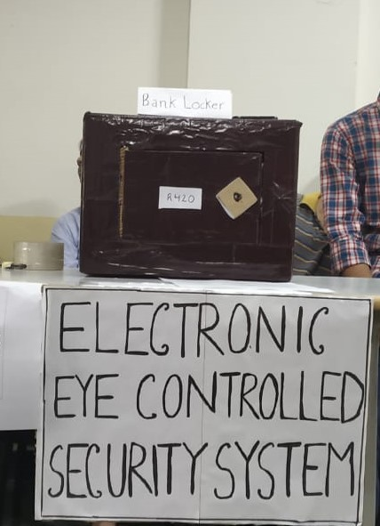
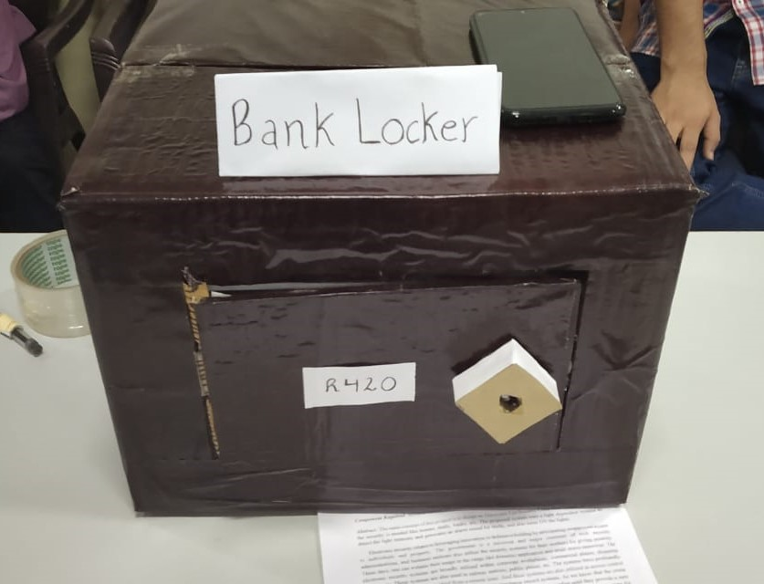

# Electronic Eye Controlled Security System
IOT based device to detect the Intruder and automatically call the owner.

## Need
Security is a big challenge everywhere because thefts are increasing day by day owing to the unsafe and insecure security systems in homes, commercial complexes and industries. Several conventional technologies are available to keep home properties safe from intruders

## Components Used
* Arduino Uno
* IR Sensor
* GSM Module

## Images

## Demo Video

https://user-images.githubusercontent.com/43988919/153780355-6f67f3ed-7c94-43e8-a3c4-57c42a29fa28.mp4
